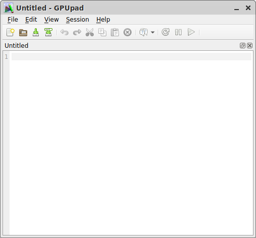
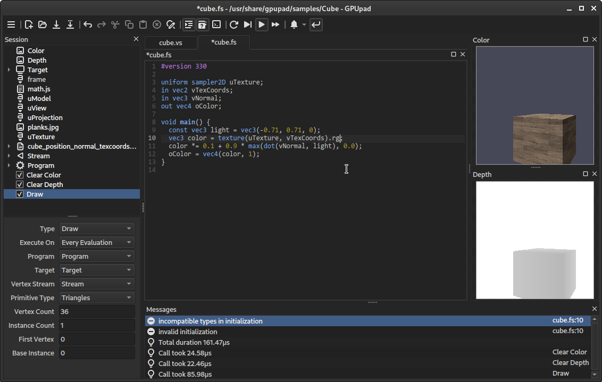

GPUpad
======
Aims to be a simple to use GLSL source code editor, which allows to immediately try out the shaders.

Features
--------
* syntax highlighting
* basic auto completion (of built-in GLSL functions and constants)
* continuous source validation (by trying to compile it using OpenGL)
* possibility to evaluate the shaders with custom data and OpenGL state
* JavaScript expressions for uniforms
* JavaScript custom actions *(still work in progress)*
* a cool dark theme

Screenshots
-----------

Session
-------
In order to try out the shaders, the session allows to define draw and compute calls, together with the pipeline state and some data the programs should operate on.

It can be populated with items from the *Session* menu or the context menu. Undo/redo, copy/paste and drag/drop should work as expected (also between multiple instances).
It is even possible to drag the items to and from a text editor (they are serialized as JSON).

### Getting Started
To get started, you can open and play around with the sample sessions in the *Help* menu.

### Evaluation
The session can be evaluated manually *[F5]*, automatically whenever something relevant changes *[F6]* or steadily, for animations *[F7]*.
All items which contributed to the last evaluation are highlighted.

### Items
The items of a session pretty much correspond the concepts known from writing OpenGL applications:

- **Call** -
Most prominently are the draw and the compute calls. Whenever the session is evaluated, all active calls are evaluated in consecutive order. They can be de-/activated using the checkbox.
The elapsed time of each call is output to the *Message* window (measured using OpenGL timer queries).

- **Program** -
Consists of one or multiple shaders, which are linked together, so they can be used by draw or compute calls.

- **Texture** -
All kind of color, depth or stencil textures can be created. They serve as sample sources, image in- and outputs and target attachments. They can be backed by files. The texture's images can also be explicitly set (for custom mip levels, cube maps&hellip;).

- **Target** -
Specifies where draws calls should render to (it corresponds to an OpenGL *FBO*). Multiple images can be attached. Depending on the attached image's type, different OpenGL states can be configured.

- **Binding** -
Allows to bind data to a program's uniforms, samplers, images, buffers and to select shader subroutines. A binding affects all subsequent calls, until it is replaced by a binding with the same name, or the scope ends (see *Groups*). The name of a binding needs to match the name of a program's binding points. The *count* is used for binding multiple values to arrays.

- **Buffer** -
Defines the structure of a region within a binary. It consists of rows with multiple columns of some data type. It can be backed by a binary file.

- **Stream** -
Serves as the input for vertex shaders. A stream consists of multiple attributes, which get their data from the referenced buffer column.

- **Group** -
Allows to structure more complex sessions. They open a new scope unless *inline scope* is checked. Items within a scope are not visible for items outside the scope (they do not appear in the combo boxes).

- **Script** -
Allows to define JavaScript functions and variables in script files, which can subsequently be used in uniform binding expressions.
There is currently only one JavaScript state for the whole session and the scripts are evaluated in consecutive order (*Group* scopes do not have an effect).

Building
--------
A C++14 conforming compiler and [Qt5](https://www.qt.io/) is required. A build script for the [Qbs](https://doc.qt.io/qbs/) build system is provided.

    git clone https://github.com/houmaster/gpupad
    cd gpupad
    qbs setup-qt /usr/bin/qmake qt5
    qbs build profile:qt5 release

* **Arch Linux** -
You can install it from the [AUR](https://aur.archlinux.org/packages/gpupad).

* **Windows** -
The provided `mscv2015.bat` can be used to generate a VisualStudio solution in the `_build` directory. The environment variable `%QTDIR%` needs to point to the Qt5 installation path.

License
-------
It is released under the GNU GPLv3. Please see `LICENSE` for license details.
