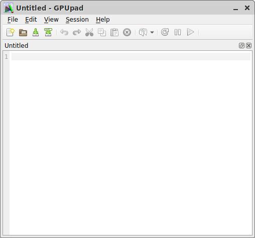
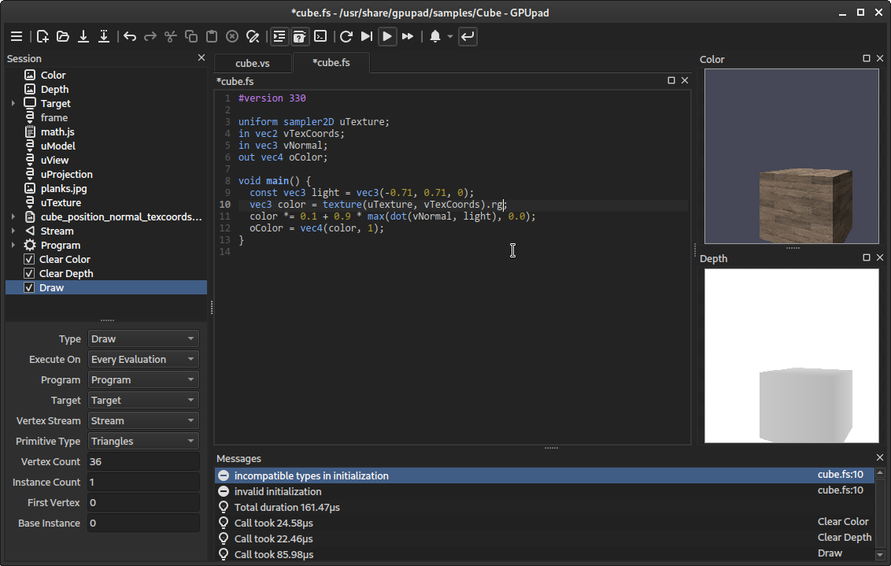
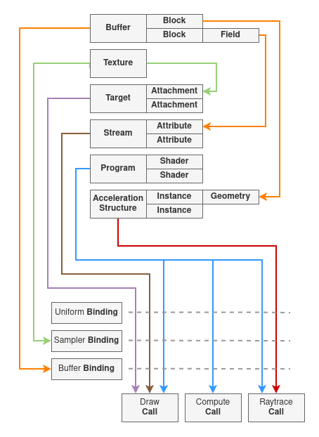

# GPUpad

<p>
<a href="https://github.com/houmain/gpupad/actions/workflows/build.yml">
</a>
<a href="https://github.com/houmain/gpupad/issues">
</a>

<a href="#features">Features</a> |
<a href="#screenshots">Screenshots</a> |
<a href="#introduction">Introduction</a> |
<a href="#installation">Installation</a> |
<a href="#building">Building</a> |
<a href="https://github.com/houmain/gpupad/blob/main/CHANGELOG.md">Changelog</a>
</p>

A lightweight editor for GLSL and HLSL shaders and a fully-featured IDE for developing GPU based algorithms.

## Features

* OpenGL, Vulkan and Direct3D 12 renderer.
* Decent source editor with automatic indentation, brace highlighting, rectangular selection&hellip;
* GLSL, HLSL and JavaScript syntax highlighting with basic auto completion.
* Possibility to evaluate shader programs with completely customizeable input and render state.
* Continuous validation of standalone shader and script files.
* Automatically defined printf function for printf-debugging.
* JavaScript expressions to define uniform input.
* Custom actions to extend the functionality.
* Dumping of preprocessed source, SPIR-V and glslang AST.
* Reading and writing of image files ([KTX](https://github.com/KhronosGroup/KTX-Software) and DDS for 3D/Array textures, block compressed textures, cube maps&hellip;).
* Streaming video files to textures (only when built with the optional dependency `Qt6Multimedia`).
* Editor for structured binary files.
* Advanced hot reloading of externally modified files.
* [Base16](https://github.com/chriskempson/base16-schemes-source) theme support.
* Sample sessions in the Help menu.

## Screenshots

<a href="screenshot1.png"></a> &nbsp;
<a href="screenshot2.png"></a>

## Introduction

### Getting Started
To get started, you can open and play around with the sample sessions in the *Help* menu.

The sample sessions can also be used as templates - saving a session As... copies all the dependencies to the new location.

### Session
In order to try out the shaders, the session allows to define draw and compute calls, together with the pipeline state and data the programs should operate on.

It can be populated with items from the *Session* menu or the context menu. Undo/redo, copy/paste and drag/drop should work as expected (also between multiple instances).
It is even possible to drag the items to and from a text editor (they are serialized as JSON).

### Evaluation
The session can be evaluated manually *[F6]*, automatically whenever something relevant changes *[F7]* or steadily *[F8]*, for animations.
All items which contributed to the last evaluation are highlighted.

### Items
A session is built from the following items:

- **Call** -
Most prominently are the draw, compute and ray trace calls. Whenever the session is evaluated, all active calls are evaluated in consecutive order. They can be de-/activated using the checkbox.
The elapsed time of each call is output to the *Message* window (measured using GPU timer queries).

- **Program** -
Consists of one or multiple shaders, which are linked together, so they can be used by draw or compute calls.

- **Texture** -
All kind of color, depth or stencil textures can be created. They serve as sample sources, image in- and outputs and target attachments. They can be backed by files.

- **Target** -
Specifies where draws calls should render to. Multiple images can be attached. Depending on the attached image's type, different render states can be configured.

- **Binding** -
Allows to bind data to a program's uniforms, samplers, images and buffers. A binding affects all subsequent calls, until it is replaced by a binding with the same name, or the scope ends (see *Groups*). The name of a binding needs to match the name of a program's binding point.

- **Buffer** -
Buffer blocks define the structure of a region within a binary. They consist of rows with multiple fields of some data type. Buffers can be backed by binary files.

- **Stream** -
Serves as the input for vertex shaders. A stream consists of multiple attributes, which get their data from the referenced buffer blocks.

- **Acceleration Structure** -
Allows to define the instances and geometry for ray tracing calls.

- **Group** -
Allows to structure more complex sessions. They open a new scope unless *inline scope* is checked. Items within a scope are not visible for items outside the scope (they do not appear in the combo boxes).

- **Script** -
Allows to define JavaScript functions and variables in script files, which can subsequently be used in uniform binding expressions.
Scripts can also be used to dynamically populate the session and generate buffer and texture data.
There is one JavaScript state for the whole session and the scripts are evaluated in consecutive order (*Group* scopes do not have an effect).



## Scripting

<details>
<summary>Initial documentation of the available script objects.</summary>

:warning: Please use the discussions section for requesting additional information or functionality.

### App

- `frame: Number`
- `time: Number`
- `timeDelta: Number`
- `date: [year, month, day, time]` - The current date
- `keyboard: Keyboard`
- `mouse: Mouse`
- `session: Item`
- `selection: [Item]`
- `currentEditor - Editor?`

- `clearSession()`
- `findItem(ItemIdent, origin: ItemIdent?, subItems: Bool?) -> Item?`
- `findItems(ItemIdent, origin: ItemIdent?, subItems: Bool?) -> [Item]`
- `trackItems(ItemIdent, origin: ItemIdent?, subItems: Bool?, callback)`
- `getParentItem(ItemIdent) -> Item?`
- `insertItem(parent: ItemIdent?, object) -> Item`
- `insertItemAfter(sibling: ItemIdent, object) -> Item`
- `insertItemBefore(sibling: ItemIdent, object) -> Item`
- `deleteItem(ItemIdent)`
- `clearItems(ItemIdent)`
- `replaceItems(parent: ItemIdent, [Object])`
- `openEditor(fileName | ItemIdent) -> Editor?`
- `setBlockData(ItemIdent, Data)`
- `setBufferData(ItemIdent, Data)`
- `setScriptSource(ItemIdent, Data)`
- `setShaderSource(ItemIdent, Data)`
- `setTextureData(ItemIdent, Data)`
- `processShader(fileName | ItemIdent, processType) -> String/Data`
- `getBufferHandle(ItemIdent) -> Number`
- `getTextureHandle(ItemIdent) -> Number`

- `isUntitled(fileName) -> bool`
- `getFileTitle(fileName) -> String`
- `callAction(id, arguments...) -> result`
- `evaluateScript(fileName)`
- `enumerateFiles(pattern) -> [filename]`
- `loadLibrary(filename) -> Library?`
- `saveEditor(filename) -> bool`
- `openFileDialog(pattern) -> filename: String?`
- `saveFileDialog(pattern) -> filename: String?`
- `readTextFile(filename) -> String?`
- `writeTextFile(filename, String) -> Bool`
- `writeBinaryFile(filename, Data) -> Bool`

### Editor

- `type: String`
- `fileName: String`
- `title: String`
- `viewportSize: [width, height]`

### Mouse

- `button: [State]` - The state of each mouse button (0 = Up, 1 = Down, 2 = Pressed, -1 = Released).
- `coord: [x, y]`
- `delta: [x, y]`
- `fragCoord: [x, y]`
- `prevCoord: [x, y]`
- `prevFragCoord: [x, y]`
- `editorSize: [width, height]`

### Keyboard

- `keys: [State]` - The state of each key (0 = Up, 1 = Down, 2 = Pressed, -1 = Released).

</details>

## Installation

### Arch Linux and derivatives

An up to date build can be installed from the [AUR](https://aur.archlinux.org/packages/gpupad-git/).

### Windows and other Linux distributions

A portable build can be downloaded from the [latest release](https://github.com/houmain/gpupad/releases/latest) page.

## Building

A C++20 conforming compiler and a [Qt6](https://doc.qt.io/qt-6/get-and-install-qt.html) installation are required. A script for the [CMake](https://cmake.org) build system is provided.

The build script generator automatically fetches the additionally required libraries:

- [KDGpu](https://github.com/houmain/KDGpu)
- [libktx](https://github.com/KhronosGroup/KTX-Software)
- [glslang](https://github.com/KhronosGroup/glslang)
- [SPIRV-Cross](https://github.com/KhronosGroup/SPIRV-Cross)
- [SPIRV-Tools](https://github.com/KhronosGroup/SPIRV-Tools)
- [SPIRV-Reflect](https://github.com/KhronosGroup/SPIRV-Reflect)
- [vulkan-memory-allocator](https://github.com/GPUOpen-LibrariesAndSDKs/VulkanMemoryAllocator)
- [spdlog](https://github.com/gabime/spdlog)

The following libraries are optional an can be installed using the system's package manager or a platform independent one like [vcpkg](https://github.com/microsoft/vcpkg/):

- [Vulkan](https://www.vulkan.org/)
- [DirectX Shader Compiler](https://github.com/microsoft/DirectXShaderCompiler)
- [OpenImageIO](https://github.com/AcademySoftwareFoundation/OpenImageIO)

### Build instructions:
<details>
<summary>On Arch Linux and derivatives</summary>

```bash
# install dependencies
sudo pacman -S qt6-declarative libdrm vulkan-headers qt6-wayland

# install optional dependencies
sudo pacman -S qt6-multimedia openimageio

# check out source
git clone --recurse-submodules https://github.com/houmain/gpupad
cd gpupad

# build
cmake -B build
cmake --build build -j4
```
</details>

<details>
<summary>On Debian Linux and derivatives</summary>

```bash
# install dependencies
sudo apt install build-essential git cmake pkg-config qt6-base-dev qt6-declarative-dev libqt6svg6-dev qt6-image-formats-plugins libgl1-mesa-dev libxcb*-dev libx11-dev qtwayland6 libxrandr-dev

# install optional dependencies
sudo apt install qt6-multimedia-dev libopenimageio-dev libopenexr-dev libz-dev openimageio-tools

# check out source
git clone --recurse-submodules https://github.com/houmain/gpupad
cd gpupad

# build
cmake -B build
cmake --build build -j4
```

</details>

<details>
<summary>On Microsoft Windows</summary>

```bash
# install Qt6
# https://doc.qt.io/qt-6/get-and-install-qt.html

# check out source
git clone --recurse-submodules https://github.com/houmain/gpupad
cd gpupad

# install optional dependencies using vcpkg
git clone --depth=1 https://github.com/microsoft/vcpkg.git
vcpkg\bootstrap-vcpkg -disableMetrics
vcpkg\vcpkg install vulkan directx-dxc openimageio

# generate Visual Studio solution (set correct path to Qt installation)
cmake -B build -DCMAKE_PREFIX_PATH=C:\Qt\6.9.0\msvc2022_64 -DCMAKE_TOOLCHAIN_FILE=vcpkg\scripts\buildsystems\vcpkg.cmake

# build Debug version and copy all dependencies to build directory
cmake --build build --config Debug
cmake --install build --config Debug --component Application --prefix %CD%\build\Debug

# open solution (Visual Studio solutions prior to 2026 have .sln extension)
start build\gpupad.slnx
```

</details>

## License

GPUpad is released under the GNU GPLv3. Please see `LICENSE` for license details.
