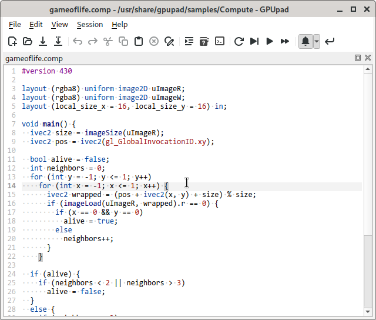

[](https://ci.appveyor.com/project/houmain/gpupad/branch/master)

GPUpad
======

Aims to be a lightweight editor for GLSL shaders of all kinds and a fully-featured IDE for developing GPU based algorithms.

Screenshots
-----------

<a href="screenshot2.png"></a> &nbsp;
<a href="screenshot1.png"></a>

Features
--------

* Cross platform and efficient.
* Decent source editor with automatic indentation, rectangular selection&hellip;
* GLSL and JavaScript syntax highlighting with basic auto completion (of built-in functions and constants).
* Continuous validation of standalone shader files (by compiling them using OpenGL).
* Possibility to evaluate shader programs with completely customizeable input and OpenGL state.
* Automatically defined printf function for printf-debugging.
* JavaScript expressions and scripts to define uniform input.
* Reading and writing of image files ([KTX](https://github.com/KhronosGroup/KTX-Software) and DDS for 3D/Array textures, block compressed textures, cube maps&hellip;).
* Streaming video files to textures.
* Editor for structured binary files.
* Sample sessions in the Help menu.

Introduction
------------

### Getting Started
To get started, you can open and play around with the sample sessions in the *Help* menu.

### Session
In order to try out the shaders, the session allows to define draw and compute calls, together with the pipeline state and data the programs should operate on.

It can be populated with items from the *Session* menu or the context menu. Undo/redo, copy/paste and drag/drop should work as expected (also between multiple instances).
It is even possible to drag the items to and from a text editor (they are serialized as JSON).

The sample sessions can also be used as templates - saving a session As... copies all the dependencies to the new location.

### Evaluation
The session can be evaluated manually *[F6]*, automatically whenever something relevant changes *[F7]* or steadily *[F8]*, for animations.
All items which contributed to the last evaluation are highlighted.

### Items
The items of a session pretty much correspond the concepts known from writing OpenGL applications:

- **Call** -
Most prominently are the draw and the compute calls. Whenever the session is evaluated, all active calls are evaluated in consecutive order. They can be de-/activated using the checkbox.
The elapsed time of each call is output to the *Message* window (measured using OpenGL timer queries).

- **Program** -
Consists of one or multiple shaders, which are linked together, so they can be used by draw or compute calls.

- **Texture** -
All kind of color, depth or stencil textures can be created. They serve as sample sources, image in- and outputs and target attachments. They can be backed by files. The texture's images can also be explicitly set (for custom mip levels, cube maps&hellip;).

- **Target** -
Specifies where draws calls should render to (it corresponds to an OpenGL *FBO*). Multiple images can be attached. Depending on the attached image's type, different OpenGL states can be configured.

- **Binding** -
Allows to bind data to a program's uniforms, samplers, images, buffers and to select shader subroutines. A binding affects all subsequent calls, until it is replaced by a binding with the same name, or the scope ends (see *Groups*). The name of a binding needs to match the name of a program's binding points.

- **Buffer** -
Buffer blocks define the structure of a region within a binary. They consist of rows with multiple fields of some data type. Buffers can be backed by binary files.

- **Stream** -
Serves as the input for vertex shaders. A stream consists of multiple attributes, which get their data from the referenced buffer blocks.

- **Group** -
Allows to structure more complex sessions. They open a new scope unless *inline scope* is checked. Items within a scope are not visible for items outside the scope (they do not appear in the combo boxes).

- **Script** -
Allows to define JavaScript functions and variables in script files, which can subsequently be used in uniform binding expressions.
There is one JavaScript state for the whole session and the scripts are evaluated in consecutive order (*Group* scopes do not have an effect).

Installation
------------

**Arch Linux and derivatives:**

An up to date build can be installed from the [AUR](https://aur.archlinux.org/packages/gpupad-git/).

**Other Linux distributions:**

No packages are provided yet, please follow the instructions for [building manually](#Building).

**Windows:**

A portable build can be downloaded from the [latest release](https://github.com/houmain/gpupad/releases/latest) page.

Building
--------

A C++17 conforming compiler and [Qt5](https://www.qt.io/) (or Qt6) are required. A script for the
[CMake](https://cmake.org) build system is provided.

**Installing dependencies on Debian Linux and derivatives:**
```
sudo apt install build-essential git cmake qtdeclarative5-dev
```

**Checking out the source:**
```
git clone --depth 1 https://github.com/houmain/gpupad
cd gpupad
```

**Building:**
```
mkdir build
cd build
cmake ..
cmake --build . --config Release
```

**Running:**
```
./gpupad
```

License
-------
It is released under the GNU GPLv3. Please see `LICENSE` for license details.
